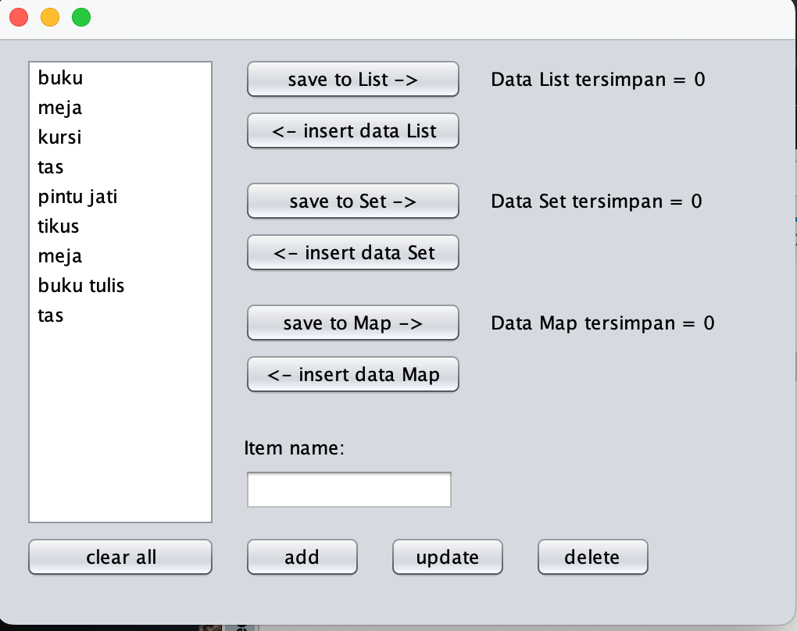
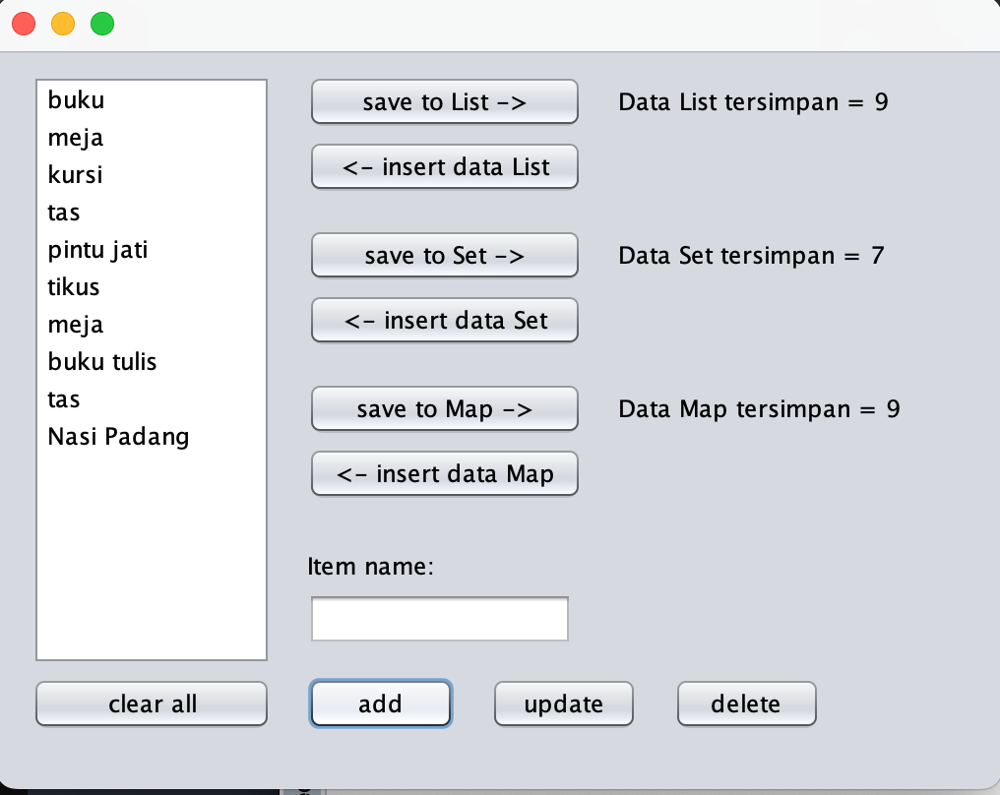
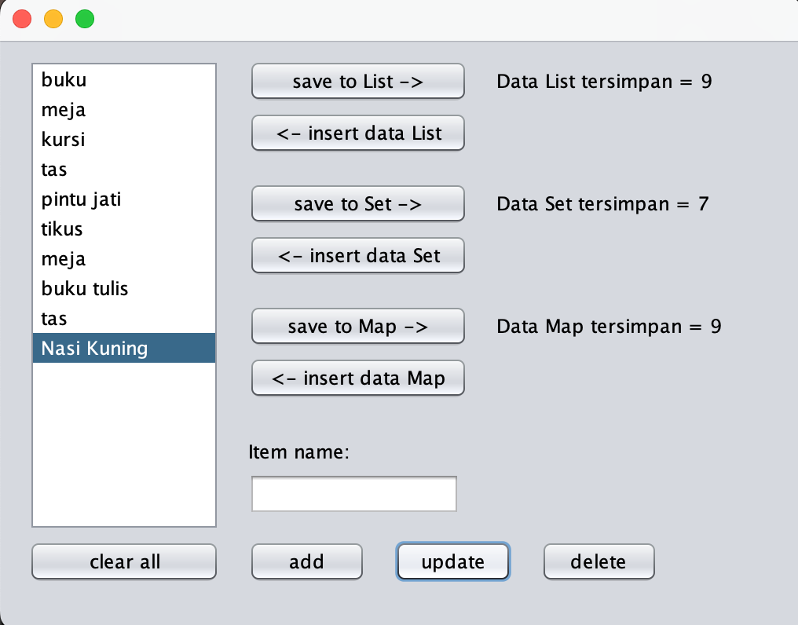
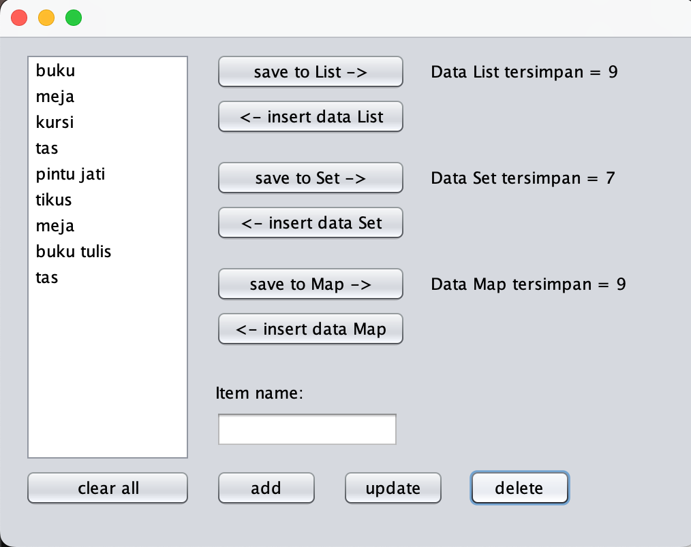
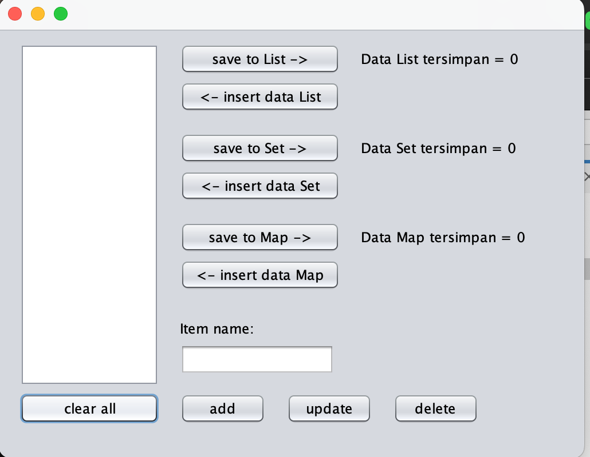
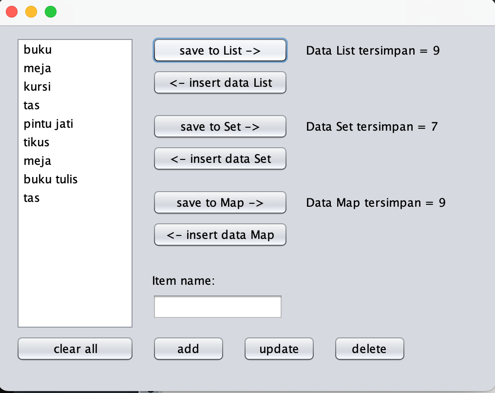
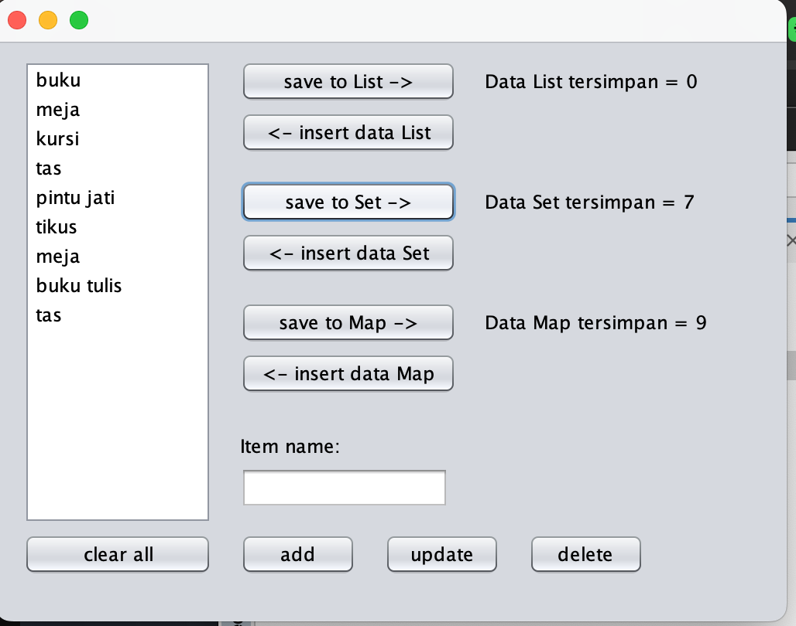
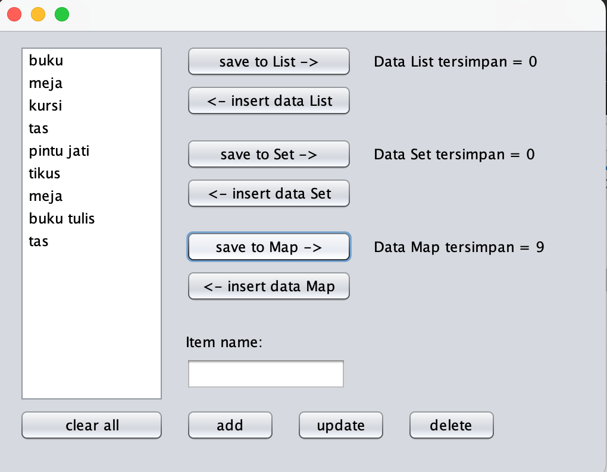

## PRAKTIKUM PBO PERTEMUAN 11
## GRAPHICAL USER INTERFACE (GUI) AND COLLECTION APLICATION
## Nama     : Muhammad Zaidan Alfarizi
## NIM      : 24060124130102
## Tanggal  : 1 Juni 2026 
## Lab      : C2

## Deskripsi
Project ini merupakan aplikasi Java sederhana yang dibuat menggunakan NetBeans. Aplikasi ini digunakan untuk latihan penggunaan `List`, `Set`, dan `Map`.

## Screenshot Aplikasi

### Tampilan UI setelah source code dieksekusi:

### Add Data

Tombol ADD menambahkan data yang dimasukkan melalui Text Field

### Update Data

Tombol Update memperbarui data yang sudah ada menjadi data yang dimasukkan melalui Text Field

### Delete Data

Tombol DELETE menghapus data yang sudah ada dengan memilih data yang ingin dihapus

### Clear All Data

Tombol Clear All menghapus seluruh data yang sudah dimasukkan ke database

### Save to List

Tombol SAVE TO LIST menyimpan data yang sudah ada ke dalam list lalu memperbarui label yang menampilkan jumlah elemen dalam list tersebut

### Save to Set

Tombol SAVE TO SET menyimpan data yang sudah ada ke dalam set lalu memperbarui label yang menampilkan jumlah elemen dalam set tersebut (elemen pada set tidak boleh sama)

### Save to Map

Tombol SAVE TO MAP menyimpan data yang sudah ada ke dalam map lalu memperbarui label yang menampilkan jumlah elemen dalam map tersebut (map menyimpan elemen dalam bentuk pasangan key dan value)

## Insert Data (List, Set, Map)
Menambahkan data yang ada pada List/Set/Map kedalam database

## Fitur Aplikasi
- Menampilkan data item pada JList
- Menambah data item
- Mengubah data item
- Menghapus data item
- Menghapus semua data
- Menyimpan data ke List
- Menyimpan data ke Set
- Menyimpan data ke Map

## Penjelasan Singkat

## Cara Menjalankan Program
1. Buka NetBeans.
2. Pilih menu File.
3. Pilih Open Project.
4. Pilih folder `GUISederhana (Pertemuan 11)`.
5. Jalankan file `Proyek2.java`.
